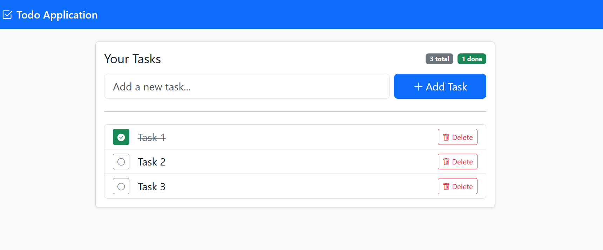

# Todo List Spring Boot Application

A simple Todo List web application built with Spring Boot, Thymeleaf, Spring Data JPA, and an embedded H2 database (file mode) for easy local development with data persistence across restarts.



## Features

- Add, view, toggle, and delete tasks
- Clean, responsive UI with Bootstrap 5 and Bootstrap Icons
- Embedded H2 database in file mode (no external DB required)
- H2 Console enabled for quick DB inspection at `/h2-console`

## Tech Stack

- **Backend:** Spring Boot 3, Spring Web, Spring Data JPA
- **View:** Thymeleaf, Bootstrap 5
- **Database:** H2 (file-based)

## Project Structure

- **Entity:** `src/main/java/com/embarkx/todo/entities/Task.java`
- **Repository:** `src/main/java/com/embarkx/todo/repositories/TaskRepository.java`
- **Service:** `src/main/java/com/embarkx/todo/services/TaskService.java`
- **Controller:** `src/main/java/com/embarkx/todo/controllers/TaskController.java`
- **Templates:** `src/main/resources/templates/tasks.html`
- **Configuration:** `src/main/resources/application.properties`

## Getting Started

### Prerequisites

- Java 17+
- Maven
- [Lombok](https://projectlombok.org/) plugin enabled in your IDE

### Setup

1. Clone the repository:
   ```sh
   git clone <repo-url>
   cd todo
   ```
2. The app is pre-configured to use H2 in file mode. Key properties in `src/main/resources/application.properties`:
   ```properties
   spring.datasource.url=jdbc:h2:file:./data/todo-db;DB_CLOSE_DELAY=-1;DB_CLOSE_ON_EXIT=FALSE
   spring.datasource.username=sa
   spring.datasource.password=
   spring.jpa.hibernate.ddl-auto=update
   spring.h2.console.enabled=true
   spring.h2.console.path=/h2-console
   ```

### Build & Run

- Build the project:
  ```sh
  ./mvnw clean verify
  ```
- Run the application:
  ```sh
  ./mvnw spring-boot:run
  ```
- Access the app at `http://localhost:8080`
- Open H2 Console at `http://localhost:8080/h2-console` (JDBC URL must match `application.properties`)

### Testing

- Run tests:
  ```sh
  ./mvnw test
  ```

## Usage

- Add a new task using the input field and "Add Task" button
- Toggle a task's completion status with the check icon
- Delete a task with the trash icon

## Customization

- Update the UI in `src/main/resources/templates/tasks.html`
- Extend the domain and endpoints via the service/repository/controller pattern

## License

MIT License

## Deploy to Render

This repo includes a `render.yaml` blueprint to deploy on [Render](https://render.com/).

### Steps

1. Push this repository to GitHub.
2. In the Render dashboard, click New → Blueprint, and point to your GitHub repo.
3. Review and create resources. Render will build with Maven and start the JAR.

### Notes

- The app binds to the `PORT` environment variable automatically via `server.port=${PORT:8080}`.
- A persistent disk is mounted at `/opt/render/project/src/data` and used by H2 (file mode) to persist data across deploys and restarts.
- Logs are available in the Render dashboard.
